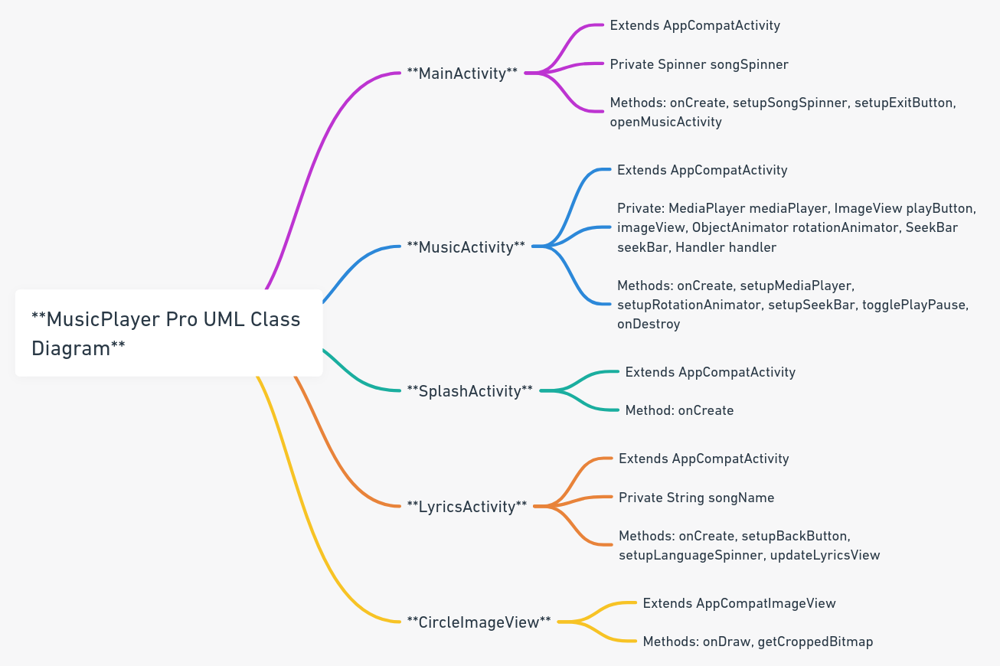

[English](README.md) | 简体中文

# MusicPlayer_Pro 技术文档

## 1.项目概述

MusicPlayer_Pro 是一个 Android 音乐播放应用，它不仅提供了基本的音乐播放和暂停功能，还支持歌词显示和自定义的圆形图像视图展示。该应用通过一个用户友好的界面，让用户能够享受到丰富的音乐播放体验。

## 2.环境要求

- Android Studio 3.0 或更高版本
- Android SDK API Level 28 或更高
- Gradle 4.1 或更高版本

## 3.功能界面模块介绍

### 主界面 (`MainActivity`)

这段代码是 `com.corddt.musicplayer_pro` 音乐播放器应用的主活动（MainActivity）的实现。它主要负责界面初始化和提供用户交互的功能。

#### 基本功能
1. **主题设置**：根据设备的当前模式（日间或夜间）设置应用的主题风格。
2. **歌曲选择器设置**：初始化并配置一个下拉列表（Spinner），允许用户从预设的歌曲列表中选择歌曲。
3. **退出按钮设置**：提供一个退出按钮，允许用户退出应用。

#### 代码运行流程
1. **onCreate(Bundle savedInstanceState)**：当活动创建时，这个方法被调用。
  - 首先根据当前的夜间模式设置主题。
  - 设置内容视图为 `activity_main` 布局。
  - 调用 `setupSongSpinner()` 和 `setupExitButton()` 方法来初始化界面组件。

2. **setupSongSpinner()**：设置歌曲选择器。
  - 从资源文件获取歌曲标题数组。
  - 创建一个包含提示性选项的新数组用于Spinner。
  - 创建并设置一个适配器以显示歌曲列表。
  - 为Spinner设置选项选择监听器，当选择歌曲时调用 `openMusicActivity` 方法。

3. **setupExitButton()**：为退出按钮设置监听器，点击时结束活动。

4. **openMusicActivity(String songName)**：根据选中的歌曲名启动 `MusicActivity`，并通过Intent传递歌曲名称。

#### 关键方法
- `onCreate(Bundle savedInstanceState)`：活动创建时的初始化方法。
- `setupSongSpinner()`：初始化和配置歌曲选择器。
- `setupExitButton()`：设置退出按钮的行为。
- `openMusicActivity(String songName)`：根据选中的歌曲打开音乐播放界面。

### 播放界面 (`MusicActivity`)

这段代码是 `com.corddt.musicplayer_pro` 应用中的 `MusicActivity` 类的实现。它主要负责音乐播放界面的功能和用户交互。

#### 基本功能
1. **播放控制**：控制音乐的播放和暂停。
2. **动画效果**：实现专辑封面的旋转动画。
3. **进度条控制**：显示和控制音乐播放进度。
4. **界面跳转**：允许用户从当前界面跳转到歌词界面或返回上一个界面。

#### 代码运行流程
1. **onCreate(Bundle savedInstanceState)**：当活动创建时，这个方法被调用。
  - 初始化界面元素（播放按钮、图片视图、进度条）。
  - 从上一个活动接收的Intent中获取歌曲名称。
  - 调用 `setupMediaPlayer`、`setupRotationAnimator` 和 `setupSeekBar` 方法来配置媒体播放器、动画和进度条。
  - 设置图片视图和播放按钮的点击事件监听器。

2. **setupMediaPlayer(String songName)**：根据传入的歌曲名称，从资源中找到对应的歌曲文件和封面图片，并配置 `MediaPlayer`。

3. **setupRotationAnimator()**：设置封面图片的旋转动画。

4. **setupSeekBar()**：设置进度条的最大值和更新逻辑，以及用户拖动进度条时的行为。

5. **togglePlayPause()**：控制音乐的播放和暂停，并根据播放状态更新按钮显示和旋转动画。

#### 关键方法
- `onCreate(Bundle savedInstanceState)`：活动创建时的初始化方法。
- `setupMediaPlayer(String songName)`：根据歌曲名设置媒体播放器。
- `setupRotationAnimator()`：设置封面图片的旋转动画。
- `setupSeekBar()`：配置音乐播放进度条。
- `togglePlayPause()`：控制音乐播放和暂停的逻辑。
- `onDestroy()`：在活动销毁时释放 `MediaPlayer` 资源。

### 歌词展示 (`LyricsActivity`)

这段代码是 `com.corddt.musicplayer_pro` 应用中的 `LyricsActivity` 类的实现。它主要负责显示歌曲歌词，并允许用户选择歌词的语言。

#### 基本功能
1. **显示歌词**：根据选择的歌曲和语言显示相应的歌词。
2. **语言选择**：提供一个下拉列表（Spinner），让用户选择歌词的语言（原文、中文、英文）。
3. **返回按钮**：提供一个返回按钮，允许用户返回上一个界面。

#### 代码运行流程
1. **onCreate(Bundle savedInstanceState)**：当活动创建时，这个方法被调用。
  - 从Intent中获取传递的歌曲名称。
  - 调用 `setupBackButton` 和 `setupLanguageSpinner` 方法来初始化界面组件。

2. **setupBackButton()**：初始化并设置返回按钮的点击事件，点击时结束当前活动。

3. **setupLanguageSpinner()**：设置语言选择器。
  - 初始化语言选择器并设置适配器。
  - 为语言选择器设置项目选择监听器，选择不同的语言时调用 `updateLyricsView` 方法更新歌词显示。

4. **updateLyricsView(int languagePosition)**：根据选择的语言位置更新歌词视图。
  - 根据选择的语言和歌曲名确定歌词资源的标识符。
  - 从资源中获取相应的歌词字符串并更新到歌词显示视图。

#### 关键方法
- `onCreate(Bundle savedInstanceState)`：活动创建时的初始化方法。
- `setupBackButton()`：设置返回按钮的行为。
- `setupLanguageSpinner()`：配置语言选择器。
- `updateLyricsView(int languagePosition)`：根据选定的语言更新歌词视图。

### 自定义封面旋转功能视图 (`CircleImageView`)

这段代码是 `com.corddt.musicplayer_pro` 应用中的 `CircleImageView` 类的实现，一个自定义的 `AppCompatImageView` 控件。它的主要功能是将加载的图像裁剪成圆形显示。

#### 基本功能
1. **圆形图像显示**：将任何分配给此视图的图像裁剪成圆形。

#### 代码运行流程
1. **构造函数**：定义了三个构造函数，分别接收不同的参数（`Context`、`AttributeSet`、`defStyleAttr`），以适应在Android应用中的不同使用场景。

2. **onDraw(Canvas canvas)**：重写 `AppCompatImageView` 的 `onDraw` 方法。
  - 检查是否有图像被设置，如果没有则不进行绘制。
  - 检查视图的宽度和高度，确保它们不为零。
  - 将获取到的 `Drawable` 转换成 `Bitmap`。
  - 调用 `getCroppedBitmap` 方法将 `Bitmap` 裁剪成圆形。
  - 在画布上绘制裁剪后的圆形图像。

3. **getCroppedBitmap(Bitmap bmp, int radius)**：一个静态方法，用于将传入的位图裁剪成圆形。
  - 检查位图的尺寸并根据需要进行缩放以适应给定的半径。
  - 创建一个新的位图和画布来绘制圆形图像。
  - 使用 `Paint` 和 `Xfermode` 来裁剪和绘制圆形图像。
  - 返回裁剪后的圆形位图。

#### 关键方法
- `onDraw(Canvas canvas)`：负责绘制图像的主要方法。
- `getCroppedBitmap(Bitmap bmp, int radius)`：用于将位图裁剪成圆形的静态辅助方法。

### Splash界面 (`SplashActivity`)

这段代码定义了 `com.corddt.musicplayer_pro` 应用中的 `SplashActivity` 类，它是一个启动画面活动（Activity），主要用于在应用启动时显示一个有动画效果的界面。

#### 基本功能
1. **显示启动画面**：在应用启动时展示一个包含动画的启动界面。
2. **日间/夜间模式适应**：根据设备当前的日间/夜间模式显示不同的启动画面布局。
3. **动画效果**：在启动画面上应用动画效果。
4. **自动跳转**：在展示一定时间后，自动跳转到应用的主界面。

#### 代码运行流程
1. **onCreate(Bundle savedInstanceState)**：当活动创建时，这个方法被调用。
  - 首先根据当前的日间/夜间模式设置相应的启动画面布局。
  - 加载定义好的动画资源。
  - 找到布局中的 `ImageView` 并对其应用动画效果。
  - 设置一个 `Handler` 来延迟3秒后执行跳转到 `MainActivity` 的操作，并结束当前 `SplashActivity`。

#### 关键方法
- `onCreate(Bundle savedInstanceState)`：活动创建时的初始化方法，包括设置布局、加载动画、应用动画以及设置延迟跳转。

### 类图展示

## 4.关键实现细节

### 进度条与封面旋转同步

为了使进度条与封面旋转动画同步，需要在用户操作进度条时实时更新封面的旋转角度。通过调用`updateRotationAnimator()`方法实现这一点。

### 歌曲资源管理

歌曲的信息（标题、文件、封面和歌词）存储在`res/values/songs.xml`中，通过资源ID映射到具体的文件。

### 异常处理

在开发过程中，需要注意对MediaPlayer的异常状态进行处理，如资源未找到、播放错误等。

## 5.布局和样式

应用的界面布局文件存放在`res/layout/`目录下，主题和样式定义在`res/values/styles.xml`中。应用支持夜间模式，不同的主题样式可在`res/values-night/`目录下配置。

## 6.构建和测试

应用使用Gradle进行构建。在构建发布版本前，需要运行Lint检查并解决所有潜在的问题。
1. 克隆仓库或下载源代码。
2. 在 Android Studio 中打开项目。
3. 连接 Android 设备或启动模拟器。
4. 构建并运行应用。

## 7.版本控制

使用Git进行版本控制，确保每次更改都有适当的提交信息，并使用分支管理功能。

## 8.未来计划

- **音频识别和自动生成歌词**：计划中的功能，旨在通过音频识别技术来自动生成歌词。
- **语言转换和翻译**：计划添加语言转换功能，帮助用户跨越语言障碍，更好地享受音乐。

### 9.贡献指南

欢迎对项目进行贡献，包括新功能、问题修复或文档改进。请遵循以下步骤进行贡献：

1. Fork 项目仓库。
2. 创建您的分支。
3. 提交您的更改。
4. 发起 Pull Request。

### 10.许可证

本项目采用 MIT 许可证。详情请参阅 [LICENSE](LICENSE) 文件。

### 11.技术支持

如果您在使用过程中遇到问题，或者有任何建议，请通过 Issue 或 Pull Request 向我们提供反馈。我们非常欢迎任何形式的贡献，共同改进 MusicPlayer_Pro。

**注**：本文档中的“我们”和“项目”指的是 MusicPlayer_Pro 应用及其开发团队。